# Software Requirements and Use Cases

## Student Assistant Hiring App
--------
Prepared by:

* `Mia Frattasio`,`WPI, WiCS`
* `Shriya Nallaparaju`,`WPI, WiCS`
* `Grace Robinson`,`WPI, WiCS`
* `Hrithika Ravishankar`,`WPI, WiCS`

---

**Course** : CS 3733 - Software Engineering

**Instructor**: Sakire Arslan Ay

---

## Table of Contents
- [1. Introduction](#1-introduction)
- [2. Requirements Specification](#2-requirements-specification)
  - [2.1 Customer, Users, and Stakeholders](#21-customer-users-and-stakeholders)
  - [2.2 User Stories](#22-user-stories)
  - [2.3 Use Cases](#23-use-cases)
- [3. User Interface](#3-user-interface)
- [4. Product Backlog](#4-product-backlog)
- [4. References](#4-references)
- [Appendix: Grading Rubric](#appendix-grading-rubric)

## Document Revision History

| Name | Date | Changes | Version |
| ------ | ------ | --------- | --------- |
|Revision 1 |2024-11-07 |Initial draft | 1.0        |
|      |      |         |         |
|      |      |         |         |

----
# 1. Introduction

Provide a short description of the software being specified. Describe its purpose, including relevant benefits, objectives, and goals.

The software will be a web application that will enhance the recruitment process for undergraduate student assistants in the Computer Science Department. The purpose is to facilitate connections between the students that want to be an SA for a class, and the instructors looking to find student assistants. Efficiency is a large benefit for the program, as the recruitment process was carried out mostly manually in the past. Management is another benefit, as it will be easy for the professors to manage their potential student assistants. Overall, the goal of the application is to improve on the recruitment process, offering an efficient, user-friendly application. 

----
# 2. Requirements Specification

This section specifies the software product's requirements. Specify all of the software requirements to a level of detail sufficient to enable designers to design a software system to satisfy those requirements, and to enable testers to test that the software system satisfies those requirements.

1.Students and professors can create accounts and input profile information (system must require authentication)
- Must be able to log in using their unique username and password to securely access the platform.
- for students, profile information includes name, email major; for professors, profile information includes name, department, contact details
3. Professors must have the ability to create, view, and manage SA positions (ex: assign students as SA) for their courses.
4. Students must be able to browse open SA positions, apply to relevant positions, and withdraw applications if they are no longer interested.
5. Professors must be able to create course sections and view list of students in a course and their qualifications
6. System should inform professor when course limit has been reached

## 2.1 Customer, Users, and Stakeholders

A brief description of the customer, stakeholders, and users of your software.

The users and stakeholders of this application will be instructors and students at WPI. Student users are students who are looking for a Student Assistant role in a WPI course while instructor users are professors who are looking to hire Student Assistants for a course section they are teaching.

----
## 2.2 User Stories
This section will include the user stories you identified for your project. Make sure to write your user stories in the form : 
"As a **[Role]**, I want **[Feature]** so that **[Reason/Benefit]** "

1. As a student, I want to create a student account and enter my profile information, so I can be a part of the student assistant program. 
2. As a student, I want to login with my username and password, so I can access the website.  
3. As a student, I want to view the open SA positions, so I can apply for the ones I am interested in. 
4. As a student, I want to apply for an SA position, so a professor has the ability to choose me. 
5. As a student, I want to view the SA positions I have applied to and check the status. 
6. As a student, I want to be able to withdraw an application so that I can show the professor that I am no longer interested in the position. 
7. As a professor, I want to be able to create an instructor account and enter my profile information, so I can find student assistants for my classes. 
8. As a professor, I want to login with my username and password, so I can access the website to choose student assistants for my classes. 
9. As a professor, I want to add my course sections, so students can see them. 
10. As a professor, I want to create SA positions for my courses, so that students can view them. 
11. As a professor, I want to see the list of students who applied for the SA positions, so I can view their qualifications. 
12. As a professor, I want to view the qualifications of each student, so I can choose my student assistants. 
13. As a professor, I want to select a student to be my student assistant.
14. As a student, I want to make sure I am only assigned to a single SA position. 
15. As a professor, I want to make sure that my course has no more SA’s than the max amount.  

----
## 2.3 Use Cases

This section will include the specification for your project in the form of use cases. 

Group the related user stories and provide a use case for each user story group. You don't need to draw the use-case diagram for the use cases; you will only provide the textual descriptions.  **Also, you don't need to include the use cases for "registration" and "login" use cases for both student and faculty users.**

  * First, provide a short description of the actors involved (e.g., regular user, administrator, etc.) and then follow with a list of the use cases.
  * Then, for each use case, include the following:

    * Name,
    * Participating actors,
    * Entry condition(s) (in what system state is this use case applicable),
    * Exit condition(s) (what is the system state after the use case is done),
    * Flow of events (how will the user interact with the system; list the user actions and the system responses to those),
    * Alternative flow of events (what are the exceptional cases in the flow of events and they will be handles)
    * Iteration # (which sprint do you plan to work on this use case) 

Each use case should also have a field called "Iteration" where you specify in which iteration you plan to implement this feature.

You may use the following table template for your use cases. Copy-paste this table for each use case you will include in your document.

| Use case # 1      |   |
| ------------------ |--|
| Name                 | Create Account for Student   |
| Participating actor  | Students                     |
| Entry condition(s)   | The student entered the program and is on the Create account page.                 |
| Exit condition(s)    | The student profile is saved.|
| Flow of events       |          
1. The student will set their account username and password. 
2. The software will then prompt the student to enter their contact information, their name, WPI ID, email and phone number. 
3. The software will then prompt the student to enter their major, cumulative GPA, and expected graduation date.  
4. The software will then prompt the student to select the courses the student has served as an SA before.          |

| Alternative flow of events   | If the user types in a non-WPI email, the system gives them an error and prompts them to change it.   |

| Iteration #   | Iteration 1  |

----
| Use case # 2      |   |
| ------------------ |--|
| Name              | Student login with Username and Password |
| Participating actor  | Student  |
| Entry condition(s)   | Student is on the login page of the application and has an account.   |
| Exit condition(s)    | Student has successfully logged in. |
| Flow of events | 
1. The student opens the login page. 
2. The student enters their username and password, or uses the SSO service through WPI. 
3. The student is logged into the application.  |

| Alternative flow of events    | The student does not have an account and the program prompts them to create an account.   |

| Iteration # | Iteration 1/ Iteration 3(for SSO process)  |

----

| Use case # 3      |   |
| ------------------ |--|
| Name              | View Open SA positions  |
| Participating actor  | Student  |
| Entry condition(s)     | Student is on the main page where all of the available SA positions are shown |
| Exit condition(s)           | Student can successfully find and pick an available SA position that they can apply for  |
| Flow of events | 
1. The student opens the login page
2. The student enters their username and password, or uses the SSO service through WPI 
3. The student is logged into the application
4. The student is sent to the main page
5. The student can view all of the open SA positions
6. The student can view the recommended SA positions for them based on the information they provided |

| Alternative flow of events    | There are no open SA positions  |

| Iteration #         | Iteration 2  |

----

| Use case # 4      |   |
| ------------------ |--|
| Name              | Apply for SA position  |
| Participating actor  | Student  |
| Entry condition(s)     | Student clicks on the open SA position they want in order to apply  |
| Exit condition(s)           | Student successfully applies to the position that they wanted |
| Flow of events | 
1. Student browses the main page
2. Student finds an open SA position that they are interested in
3. Student clicks on the position
4. Student clicks apply
5. The student enters the required information to apply (the grade they earned in the class, the year and term they took the class, and the year and term they are applying for the SAship)
6. Student applies for the position |

| Alternative flow of events    | The acceptable amount of applications submitted for the position has reached its limit  |

| Iteration #         | Iteration 2  |

----

| Use case # 5      |   |
| ------------------ |--|
| Name              | View the SA position  |
| Participating actor  | Student  |
| Entry condition(s)     | Student clicks on and views the status page in order to see all submitted applications and status   |
| Exit condition(s)           | Student successfully receives information about application status |
| Flow of events | 
1. Student clicks on status page
2. Student views all applications submitted by them
3. Student clicks on application to see more specifics about the application
4. Student can view status after clicking application
5. Student can view status by looking in top right hand corner of application |

| Alternative flow of events    | The student has not applied for any positions |

| Iteration #         | Iteration 3  |

----

| Use case # 6      |   |
| ------------------ |--|
| Name              | Withdraw pending application  |
| Participating actor  | Student  |
| Entry condition(s)     | Student is on their submitted application page and has a withdraw option |
| Exit condition(s)           | Student successfully clicks the withdraw button and withdraws application with a successfully withdrawn message shown  |
| Flow of events | 
1. Student is on the status pages viewing all submitted applications
2. Student clicks on the application that they want to withdraw from
3. Student clicks withdraw button
4. A message is shown at the top of the page to indicate that the student successfully withdrew their application  |

| Alternative flow of events    | The student has no applications that are pending |

| Iteration #         | Iteration 3 |

----

| Use case # 7      |   |
| ------------------ |--|
| Name              | Create instructor account  |
| Participating actor  | Professor   |
| Entry condition(s)     | The Professor entered the program and is on the create account page  |
| Exit condition(s)           | The Professor profile is saved |
| Flow of events | 
1. The professor will set their account username and password. 
2. The software will then prompt the professor to enter their contact information, their name, WPI ID, email and phone number. 
3. The software will then prompt the professor to select the class that they are offering an SA position in |

| Alternative flow of events    | The professor does not input a WPI email so an error is given to remind them to use a WPI email |

| Iteration #         | Iteration 1  |

----

| Use case # 8     |   |
| ------------------ |--|
| Name              | Instructor login   |
| Participating actor  | Professor  |
| Entry condition(s)     | The professor is on the login page of the application and has an account.  |
| Exit condition(s)           | The professor has entered the correct email and password.  |
| Flow of events | 
1. A student opens the login page of the application.
2. The professor enters their username and password in the appropriate fields on the program’s login page or uses SSO to log into their account.
3. The professor is logged into the application.  |

| Alternative flow of events    | If the professor does not enter the correct username or password, the application will return an error message indicating that the username or password was incorrect. If the username or password field was not filled out, the application will return an error message indicating that there are empty fields.  |

| Iteration #         | Iteration 1  |

----

| Use case # 9     |   |
| ------------------ |--|
| Name              | Add course sections |
| Participating actor  | Professor  |
| Entry condition(s)     | User is logged into a professor account and is on the page allowing them to add course sections.  |
| Exit condition(s)           | User has chosen a course and entered a unique section number for it as well as a valid year and term for the course to be taught.  |
| Flow of events | 
1. Professor is on the page that allows them to add course sections.
2. Professor selects the course number of a course that they are teaching.
3. Professor enters a unique course section number for the course they are teaching.
4. Professor enters the year and term in which they are planning on teaching the course.
5. Professor selects an option allowing them to save the course section they have entered.
6. System saves responses.  |

| Alternative flow of events    | If the course section number that the professor has entered is not unique, the system will return an error message indicating that the professor must choose a different section number. If the year and term that the user has entered is in the past or during a time in which the selected course is not offered, the system will return an error indicating that the user must choose a valid year and term.  |

| Iteration #         | Iteration 1  |

----

| Use case # 10   |   |
| ------------------ |--|
| Name              | Create SA positions  |
| Participating actor  | Professor |
| Entry condition(s)     | User is logged into a professor account and is on the page that allows them to create SA positions.  |
| Exit condition(s)           | Professor enters and saves valid requirements for SA position for their selected course.  |
| Flow of events | 
1. Professor selects the course for which they would like to create SA positions.
2. Professor enters the number of SAs needed for the course section.
3. Professor enters the requirements for an applying SA, such as their minimum GPA, the minimum grade that they must have earned in that course, and their prior SA experience.
4. Professor selects option allowing them to save and post their choices.
5. System saves professors responses.  |

| Alternative flow of events    | If the professor enters an invalid minimum GPA (anything less than 0 or greater than 4.0, assuming that we are using a 4-point scale) for an applying SA, the program will return an error message indicating that they must enter a valid GPA. Similarly, if they enter an invalid minimum grade for the class (e.g. E if we are using the letter grading scale), the program will return an error message indicating that they must enter a valid minimum grade. |

| Iteration #         | Iteration 1  |

----

| Use case # 11     |   |
| ------------------ |--|
| Name              | View list of students who applied |
| Participating actor  | Professor  |
| Entry condition(s)     | User must be logged into a professor account. |
| Exit condition(s)           | User has selected the option that allows them to view SA applicants.  |
| Flow of events | 
1. Professor selects the option that allows them to view SA applicants.
2. System navigated to page allowing professor to view list of SA applicants.
3. Professor is able to view the students who have applied for the SA position.  |

| Alternative flow of events    | If the professor clicks any option that does not allow them to view the list of SA applicants, they will not be able to view the SA applicants and will instead be navigated to whichever page the selected option allows a user to navigate to. If no students have applied for the SA position for that course section, the program will return a message indicating that there are no SA applicants. |

| Iteration #         | Iteration 2  |

----

| Use case # 12     |   |
| ------------------ |--|
| Name              | View qualifications of students |
| Participating actor  | Professor  |
| Entry condition(s)     | Professor is logged into the system and has navigated to the student qualifications section/page |
| Exit condition(s)           | Qualifications of a student (or more) are displayed to view |
| Flow of events | 
 1.  The professor selects the option to view qualifications
 2.  The system displays a list of students
 3.  The professor selects a student.
 4.  The system displays the qualifications of the selected student  |

| Alternative flow of events    | In the scenario that there are no qualifications listed for a student, the system will display a message saying that there are no qualifications listed. |

| Iteration #         | Iteration 3  |

----

| Use case # 13     |   |
| ------------------ |--|
| Name              | Select student and assign as SA |
| Participating actor  | Professor  |
| Entry condition(s)     | Professor is logged into system and has permission (from system) to assign the SA title to student|
| Exit condition(s)           | Selected student is assigned as an SA for the course|
| Flow of events | 
 1.  The professor selects an option that allows them to view list of students
 2.  The professor selects a student from the list
 3.  The system confirms if student applied for SA position
 4.  If confirmed, the system assigns student as an SA and updates open SA positions|

| Alternative flow of events    | If the student is already assigned as an SA, the system will display a message stating this and will not proceed further. |

| Iteration #         | Iteration 3  |

----

| Use case # 14     |   |
| ------------------ |--|
| Name              | Student is assigned to one position |
| Participating actor  | Professor  |
| Entry condition(s)     | Student is eligible for a position (ex: met prerequisites |
| Exit condition(s)           | The student is assigned to a position in the course (no additional assignments can be made)|
| Flow of events | 
 1.  The professor selects student and assigns them to new position
 2.  System confirms if the student is already assigned to any position.
 3.  If not assigned, the system assigns the student to the selected position.|

| Alternative flow of events    | If the student is already assigned a position, the system will display a message stating this and will not proceed further.  |

| Iteration #         | Iteration 3  |

----

| Use case # 15     |   |
| ------------------ |--|
| Name              | Course has no more than max amount of SA’s |
| Participating actor  | Professor  |
| Entry condition(s)     | The professor is logged into the system and is on the course page with access to add or manage SAs. |
| Exit condition(s)           | The number of SAs for the course does not exceed the specified maximum limit |
| Flow of events |
 1. The professor selects a course to view/update SA assignments
 2. The professor attempts to add an SA to the course.
 3. The system checks the current number of assigned SAs.
 4.  If the number of SAs is below the maximum, the system confirms the assignment and updates the list of SAs|

| Alternative flow of events    | If the course has already reached the maximum number of SAs, the system will display a message stating this and will not proceed further.  |

| Iteration #         | Iteration 3  |

----
# 3. User Interface

Here you should include the sketches or mockups for the main parts of the interface.
You may use Figma to design your interface:

  Example image. The image file is in the `./images` directory.

  <kbd>
      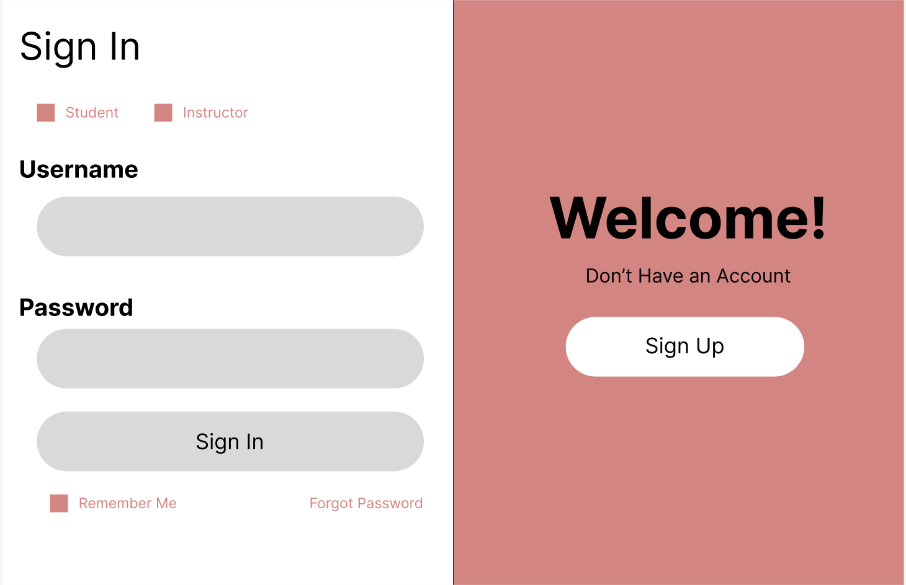
  </kbd>

  <kbd>
      
  </kbd>

  <kbd>
      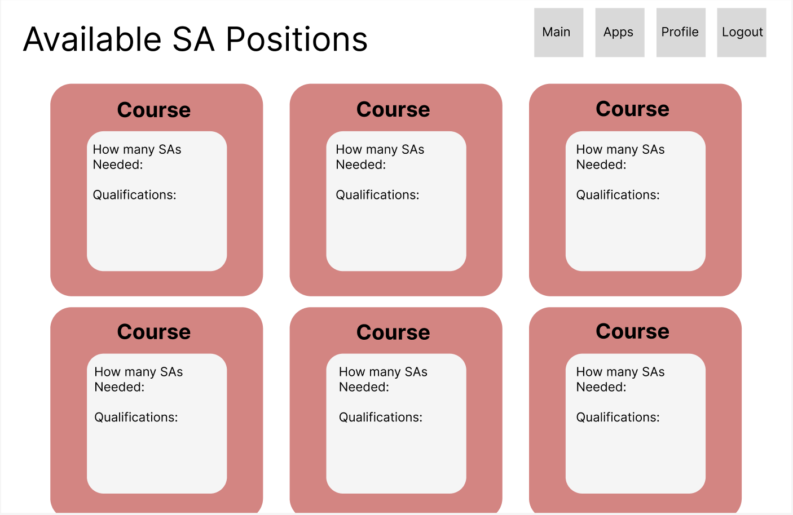
  </kbd>

  <kbd>
      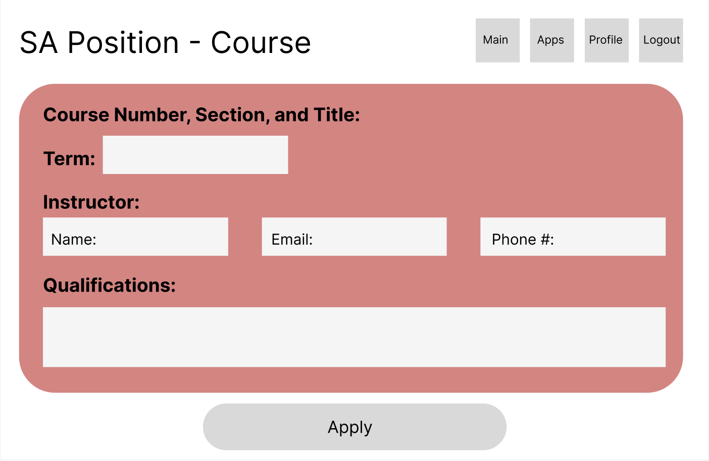
  </kbd>

  <kbd>
      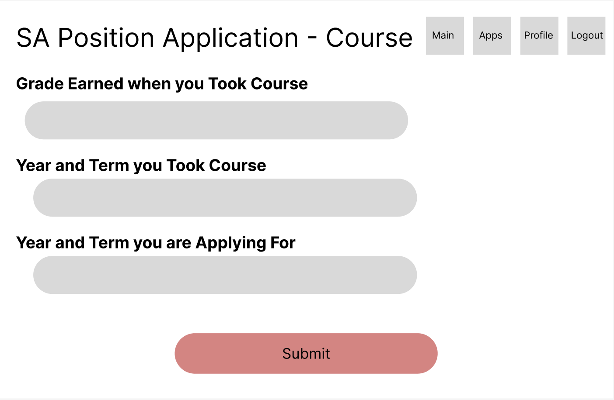
  </kbd>

  <kbd>
      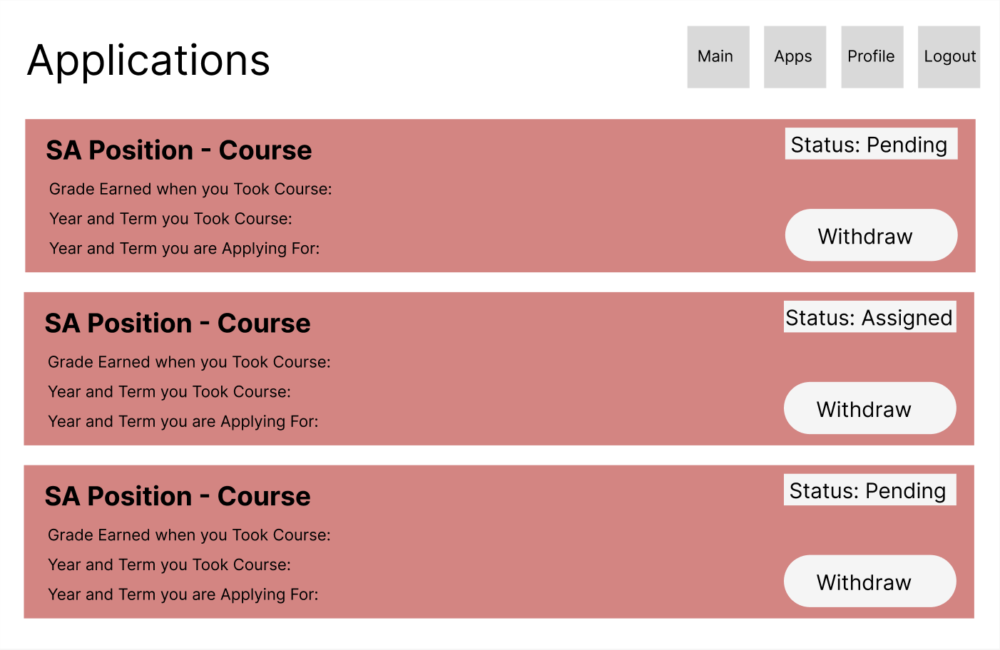
  </kbd>

  <kbd>
      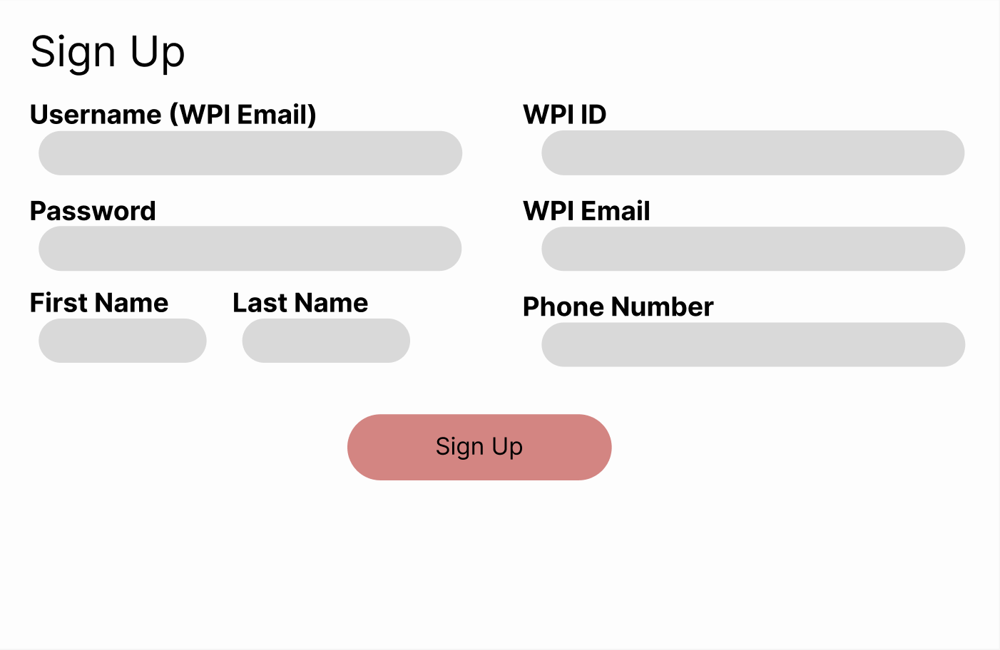
  </kbd>

  <kbd>
      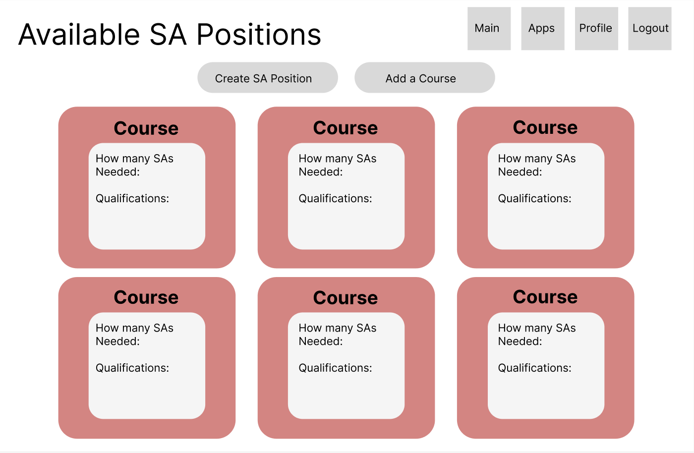
  </kbd>

  <kbd>
      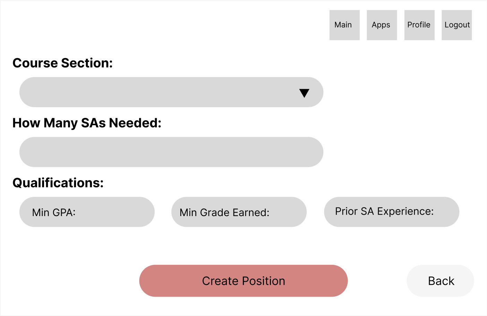
  </kbd>

  <kbd>
      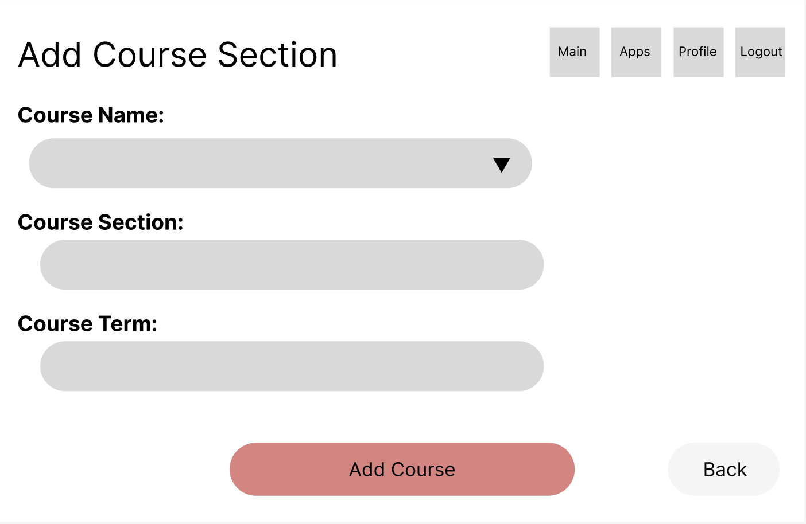
  </kbd>

  <kbd>
      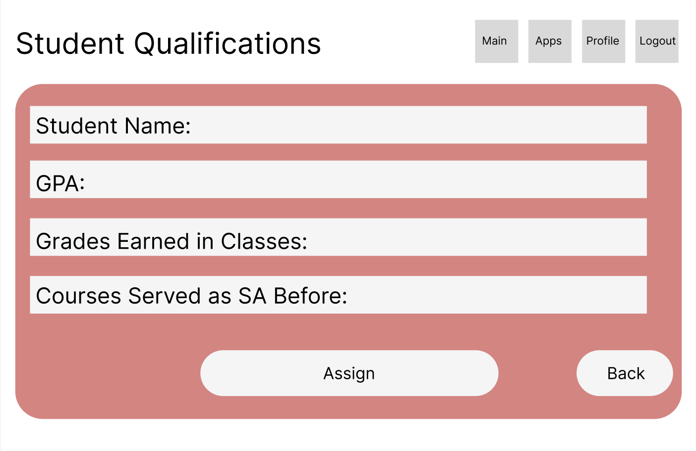
  </kbd>

  <kbd>
      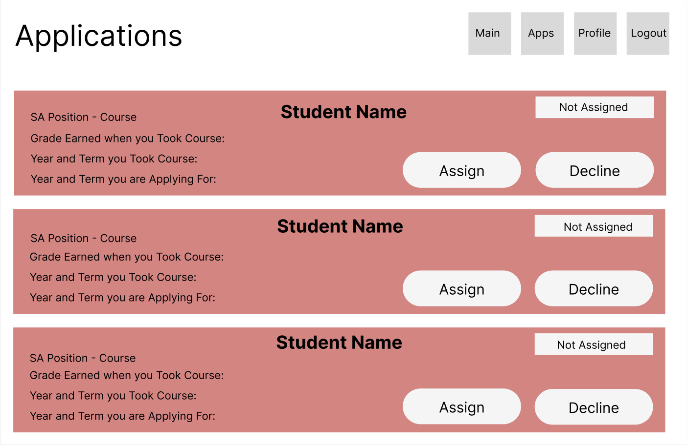
  </kbd>
  
----
# 4. Product Backlog

Here you should include a link to your GitHub repo issues page, i.e., your product backlog. Make sure to create an issue for each user story.  

https://github.com/WPI-CS3733-2024B/termproject-wics/issues

----
# 5. References

Cite your references here.

For the papers you cite give the authors, the title of the article, the journal name, journal volume number, date of publication and inclusive page numbers. Giving only the URL for the journal is not appropriate.

For the websites, give the title, author (if applicable) and the website URL.

We did not use any outside references.

----

